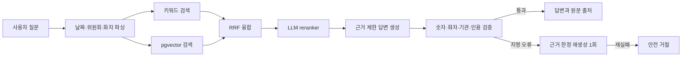
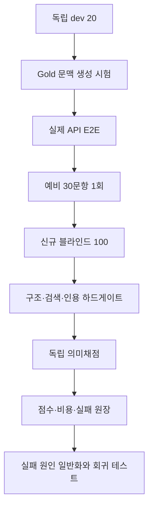

# 국회 회의록 근거형 RAG — 포트폴리오 요약

## 한 줄 소개

국회 회의록 42만여 발언 청크에서 질문의 날짜·위원회·발언자를 찾고, 답변의 모든 사실을
원문 인용과 연결하며, 근거가 부족하면 거절하는 GovTech RAG 서비스다.

## 내가 해결한 문제

- PDF 회의록을 발언자 turn과 검색 chunk로 변환하고 PostgreSQL·pgvector에 적재했다.
- 키워드 검색과 벡터 검색을 RRF로 결합하고 LLM reranker로 최종 문맥을 선별했다.
- 답변의 인용 번호·숫자·화자·위원회·날짜·평가 표현을 사후 검증하고 위험한 답변은 한 번 재생성한다.
- 개발셋, 예비셋, 독립 블라인드를 분리한 평가 루프와 비용·실행 hash·실패 원장을 구현했다.
- 높은 점수를 주던 기존 채점의 문제를 발견하고 의미 정확도·인용·거절·치명 오류를 분리해 다시 측정했다.

## 시스템 구조

## 최종 측정 결과

평가는 정답을 제거한 신규 질문 100개를 한 번만 실행한 뒤, 고정 gold와 별도
`gpt-5.6-sol` high 채점기로 판정했다. 자체 제작 평가셋이므로 공인 벤치마크로 표현하지 않는다.

| 지표 | 결과 | 포트폴리오 기준 | 판정 |
|---|---:|---:|---|
| RRF Recall@10 | 96.67% | 85% | PASS |
| 최종 문맥 Recall@5 | 100% | 85% | PASS |
| 인용 정확도 | 96.67% | 95% | PASS |
| 답변 불가 거절 | 100% | 100% | PASS |
| 의미 정확도 | 81% | 90% | FAIL |
| 치명 오류 | 4건 | 0건 | FAIL |

결론은 **검색·인용은 포트폴리오 기준을 넘었지만 답변 완전성은 아직 미달**이다. 이 프로젝트를
“90점 완성품”으로 포장하지 않고, 실패 원인과 수정 범위를 함께 제시한다.

## 최종평가 이후 치명 오류 보완

최종 점수는 81점으로 고정했다. 공개된 블라인드를 다시 실행해 점수를 올리지 않고 치명 오류
4건의 일반 원인만 수정했다.

| 문제 | 원인 | 일반 수정 |
|---|---|---|
| 답변 가능 질문 거절 | `13,500-9,000=4,500`을 근거 밖 숫자로 오인 | 같은 계수사의 명시값 두 개에서 계산되는 차이만 허용 |
| 답변 가능 질문 거절 | `전날 국방부차관`의 `전날`을 사람 이름으로 오인 | 상대 시점 표현을 인물 후보에서 제외 |
| 예산 종점 누락 | 원문의 `6조 4800` 생략 단위를 차단하고 증가액만 남김 | 조 단위 뒤 억 원 생략 동치와 전후 종점 보존 가드 추가 |
| 근거 없는 당적 추가 | 정당과 무관한 질문에도 source 당적을 모델에 노출 | 정당 질문에서만 당적을 전달하고 불필요한 당적 문구 후처리 |

- API 재평가: 수행하지 않음
- 공식 최종 점수: 81점 유지
- 로컬 회귀: **336 PASS**, 실패 0

## 평가 루프에서 보여준 엔지니어링

- 데이터·런타임 SHA-256을 저장해 다른 코드와 결과가 섞이는 것을 차단했다.
- HTTP 실패·JSON 오류·성공 응답을 별도 원장에 남겨 비용과 누락을 숨기지 않았다.
- 최종 블라인드 공개 후에는 같은 문제로 점수를 다시 만들지 않는 원칙을 적용했다.
- LLM 채점 오판도 별도 실패로 기록하고 공식 점수는 사후에 올리지 않았다.

## 이력서용 요약 문장

- 국회 회의록 42만여 청크 기반 FastAPI·PostgreSQL/pgvector 하이브리드 RAG 서비스 구축
- 키워드·벡터 검색을 RRF와 LLM reranking으로 결합해 독립 블라인드 RRF@10 96.67%, Context@5 100% 달성
- 답변 인용·숫자·화자·기관 검증과 안전 거절을 구현해 인용 정확도 96.67%, 답변 불가 거절 100% 측정
- 데이터/런타임 동결, 독립 의미채점, 비용 원장, 실패 회귀셋을 포함한 재현 가능한 LLM QA 루프 설계

## 면접에서 먼저 말할 한계

1. 최종 의미 정확도는 81%로 목표 90%에 미달했다.
2. 최종평가 뒤 치명 오류를 수정했지만 새 독립 블라인드로 점수 상승을 검증하지 않았다.
3. 예비 안정성 검사는 비용·시간 결정으로 3회가 아니라 1회만 수행했다.
4. gold는 Codex 원문 대조와 LLM 독립 채점을 사용했으며 도메인 전문가 전수 검수는 아니다.
5. 배포본은 무료 저장 용량 때문에 전체 로컬 코퍼스보다 축소돼 있다.

## 근거 자료

- 최종 보고: [`FINAL_REPORT.md`](FINAL_REPORT.md)
- 점수표: [`SCOREBOARD.md`](SCOREBOARD.md)
- 전체 실행 기록: [`RUN_LOG.md`](RUN_LOG.md)
- 문제·해결 기록: [`QA_ISSUES.md`](QA_ISSUES.md)
- 원본 최종 게이트: `data/llm_loop_v2/round3/runs/blind-final/gate_summary.json`
- 검색 보고서: `data/llm_loop_v2/round3/runs/blind-final/retrieval_trace_report.json`
- 비용 원장: `data/llm_loop_v2/round3/api_spend_summary.json`
