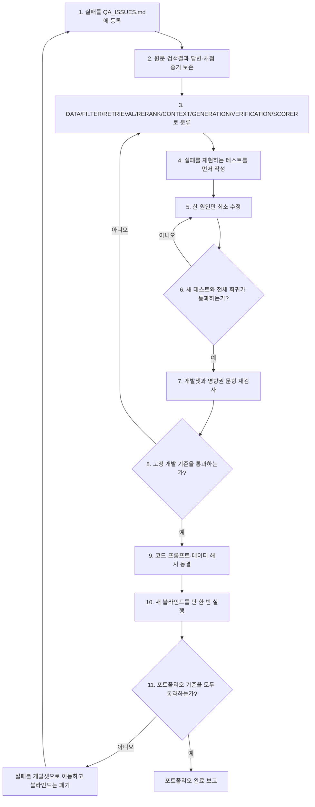

# 국회 회의록 RAG 포트폴리오 QA 계획

- 문서 버전: `2.1`
- 상태: `ACTIVE`
- 적용 저장소: `C:\National_Assembly_3`
- 원칙: 결과를 본 뒤 기준·정답·분모를 바꾸지 않는다.

## v1에서 발견한 설계 결함과 보강

| v1 결함 | 위험 | v2 보강 |
|---|---|---|
| 최종 점수만 있고 단계별 합격선이 없음 | 검색 실패를 프롬프트로 잘못 수정 | 데이터·검색·생성·검증·전체 연결 게이트 분리 |
| 블라인드와 개발 데이터의 수명주기가 불명확 | 본 문제를 다시 풀어 점수 상승 | 데이터 역할·열람 시점·폐기 규칙 고정 |
| 채점기의 오탐 검증 절차가 약함 | `3대/세 대` 같은 정상 답변 감점 | 채점기 보정셋·불일치 재검토·버전 분리 |
| 한 명이 개발과 QA를 모두 수행 | 수정 직후 유리하게 판정할 위험 | 개발·QA·채점·감사 단계와 산출물 분리 |
| 실패 수정의 일반화 증거가 없음 | 질문 ID별 땜질 | 유사 사례 2개와 반례 1개까지 의무 검증 |
| 점수의 분자·분모 정의가 약함 | 96·92·82처럼 서로 다른 값을 비교 | 공식 점수와 진단 점수를 명칭·분모와 함께 고정 |
| 부분 실행·재시도 처리 규칙이 약함 | 성공한 호출만 남겨 점수·비용 왜곡 | 원본 ledger, 정확한 ID 집합, 부분 실행 무효화 |

## 절대 변경하지 않는 보호 규칙

1. QA 실행을 시작한 뒤에는 코드·프롬프트·모델·정답·필터를 수정하지 않는다.
2. 개발셋을 통과하기 전에는 예비·블라인드 데이터를 열거나 실행하지 않는다.
3. 최종 블라인드 결과를 본 뒤 합격선이나 질문 범위를 낮추지 않는다.
4. 실패한 블라인드는 즉시 폐기하고 개발 회귀셋으로만 이동한다.
5. 제품 코드에 질문 ID나 특정 정답 문자열을 넣는 방식의 수정은 금지한다.
6. 모든 API 호출은 성공·실패와 관계없이 토큰과 비용 ledger를 남긴다.
7. 기존 `grounding=FULL`은 정확도 점수로 사용하지 않는다.
8. `REVIEW`는 최종 점수에서 PASS가 아니라 FAIL로 계산한다.

## 목표

새 질문에서도 근거를 정확히 찾고, 근거에 있는 내용만 답하며, 근거가 없을 때만
거절하는 시스템을 만든다. 점수를 높게 보이게 만드는 것이 아니라 아래 고정 기준을
모두 통과할 때만 포트폴리오 완료로 표시한다.

## 역할 분리

Codex 한 명이 수행하지만 작업 단계는 섞지 않는다.

1. **개발 단계**: 원인을 수정하고 단위·회귀 테스트를 작성한다.
2. **QA 단계**: 코드를 수정하지 않고 동결된 코드와 데이터만 실행한다.
3. **채점 단계**: 고정 정답·규칙 채점·독립 의미채점을 결합한다.
4. **감사 단계**: 원본 응답, 비용, 해시, 실패 사유가 기록과 일치하는지 검산한다.

QA 실행 중에는 코드를 고치지 않는다. 실패가 나오면 실행을 종료하고 문제를 개발셋으로
옮긴 뒤 새로운 개발 회차를 시작한다.

## 고정 포트폴리오 합격 기준

| 항목 | 기준 |
|---|---:|
| 전체 의미 정확도 | 90% 이상 |
| 정답 근거 인용 정확도 | 95% 이상 |
| 답변 불가 질문의 올바른 무인용 거절 | 100% |
| 근거 없는 주장·치명적 환각 | 0건 |
| 질문 유형별 의미 정확도 | 각 유형 80% 이상 |
| 전체 자동·통합 테스트 | 100% 통과 |
| 최종 실행 누락·중복·HTTP 오류 | 0건 |

기준은 평가 결과를 본 뒤 낮추지 않는다. 개발 중 참고용 점수와 최종 포트폴리오
합격 점수는 분리해서 기록한다.

### 점수의 정확한 정의

- 전체 의미 정확도: 최종 PASS 문항 수 / 전체 100문항. `REVIEW`와 자동 치명 실패는 FAIL이다.
- 인용 정확도: 답변 모델에 실제 제시된 `support_chunk_ids` 안에 정답 chunk가 있고,
  사용자 citation API와 독립 의미채점에도 동일 문맥이 제공되며 citation support가 만점인
  답변 가능 문항 수 / 답변 가능 90문항. 최소 86/90이어야 한다.
- 답변 불가 거절: 실질 답변과 인용 없이 명확히 거절한 문항 수 / 답변 불가 10문항.
  10/10만 통과한다.
- 치명적 환각: 인용에 없는 인물·기관·숫자·결정, 잘못된 날짜·위원회·관계 방향,
  답변 가능한 질문의 허위 거절을 포함한다.
- 공식 비교표에는 `분자/분모`, 채점기 버전, 데이터 해시, 런타임 해시를 항상 함께 기록한다.
- 95% 신뢰구간은 참고값으로 표시하되 합격선을 대체하지 않는다.

## 평가 데이터 수명주기

| 데이터 | 용도 | 열람·반복 | 종료 후 처리 |
|---|---|---|---|
| 개발셋 | 구현 중 원인 수정 | 반복 가능 | 계속 유지 |
| 회귀셋 | 과거 실패 재발 방지 | 매 수정마다 반복 | 계속 누적 |
| 채점 보정셋 | 채점기 오탐·미탐 검사 | 채점기 변경마다 반복 | 점수 계산에서 제외 |
| 예비셋 | 반복 안정성 확인 | 동결 후 정해진 횟수만 | 사용 후 개발셋으로 이동 |
| 최종 블라인드 | 포트폴리오 최종 판정 | 단 한 번 | 성공 여부와 관계없이 폐기 |

- `source_id` 기준으로 개발·회귀·예비·블라인드의 중복을 검사한다.
- 동일 회의의 인접 청크도 누수 가능성이 있으므로 meeting/source 단위 중복을 함께 차단한다.
- 정답 작성자는 질문을 만들 때 원문을 보지만, 답변 시스템에는 정답·gold evidence를 전달하지 않는다.
- 최종 질문 파일에는 질문·필터만 남기고 정답·필수 주장·source ID를 제거한다.

## 단계별 품질 게이트

앞 단계가 실패하면 다음 단계와 유료 최종 평가를 실행하지 않는다.

| 게이트 | 시험 대상 | 통과 기준 | 실패 시 수정 대상 |
|---|---|---|---|
| G0 데이터 | 원문·정답·부정 증명 | 스키마·근거·중복·범위 오류 0 | `DATA` |
| G1 실행환경 | 테스트·DB·API·해시 | 전체 테스트 100%, health 정상, 사용자 경로와 평가 경로 동등성 확인, 변경 파일 0 | `INFRA` |
| G2 필터·검색 | LLM 제외 검색 결과 | RRF Recall@10 85%+, 최종 문맥 Recall@5 85%+, 날짜·위원회 필터 오류 0, 유형별 RRF Recall@10 75%+ | `FILTER/RETRIEVAL/RERANK` |
| G3 정답문맥 생성 | gold 원문을 직접 제공 | 의미 정확도 95%+, 근거 없는 주장 0, 잘못된 거절 0 | `GENERATION` |
| G4 검증기 | 정상·오답 반례 | 치명 오답 차단 100%, 정상 답변 오차단 2% 이하 | `VERIFICATION` |
| G5 개발 E2E | 개발+회귀 전체 | 의미 90%+, 인용 95%+, 거절 100%, 치명 오류 0 | 원인별 재분류 |
| G6 안정성 | 예비 30문항×3회 | 전체 노출 90%+, 각 문항 2/3+, 치명 오류 0 | 변동 원인 |
| G7 최종 블라인드 | 신규 100문항 1회 | 고정 포트폴리오 기준 전부 통과 | 실패 폐기·개발 승격 |

G2에서는 검색 전 후보, RRF 결합 결과, LLM 재순위 결과를 각각 저장한다. 정답 청크가
검색 전부터 없으면 `RETRIEVAL`, 검색 후보에는 있지만 결합 뒤 밀리면 `RERANK`, 최종
문맥에서 사라지면 `CONTEXT`로 판정한다. RRF는 이 증거가 있을 때만 변경 대상으로 삼는다.

G1의 경로 동등성은 실제 UI가 사용하는 streaming 경로와 평가 API가 동일한 라우터·검색·
프롬프트·모델·검증 설정을 쓰는지 해시와 통합 테스트로 확인한다. 두 경로가 다르면 한쪽의
점수를 제품 성능으로 보고하지 않는다.

## 데이터 구성과 난이도 통제

- 최종 100문항은 사실 25, 인물·날짜·위원회·숫자 20, 종합 20,
  비교·시계열 25, 답변 불가 10의 고정 분포를 사용한다.
- 특정 위원회·연도·발언자·문서 형식이 전체의 20%를 넘지 않도록 편중을 검사한다.
- 단순 안건번호·이름 찾기만으로 점수를 채우지 않고 직접 사실·관계 방향·수치·종합·거절을 포함한다.
- 질문 템플릿의 문장 유사도와 동일 source/meeting을 검사해 사실상 중복인 문제를 제거한다.
- 쉬움·보통·어려움 난이도를 정답에 필요한 청크 수, 관계 수, 필터 수로 정의하고 분포를 기록한다.
- 골드 수치는 `required_exact_values`와 `reference_values`로 분리한다. 자동 실패는 질문이
  직접 요구하는 `required_exact_values`에만 적용한다.
- 답변 불가 문제는 대상 회의가 실제 존재하고 대상 발언자 청크만 0건이며 다른 회의의
  발언 이력은 존재한다는 부정 증명을 가져야 한다.
- 후보를 제외한 이유도 저장해 쉬운 원문만 골라 점수가 높아지는 선택 편향을 확인한다.
- 질문 문장의 절반 이상은 원문 표현을 그대로 복사하지 않은 자연스러운 사용자형 질문으로 만든다.

### 골드 정답 검토

1. 작성 단계에서는 질문·정답·필수 주장·금지 주장·직접 evidence quote를 함께 만든다.
2. 구조 검증 단계에서는 질문에 답이 노출됐는지, exact value가 원문에 있는지,
   질문 범위보다 필수 주장이 넓지 않은지 자동 검사한다.
3. 원문 검토 단계에서는 작성 모델의 설명을 신뢰하지 않고 질문·정답·원문만 다시 대조한다.
4. 충돌·OCR 훼손·앞 문맥 의존·원문 자체 모순이 있으면 고치지 않고 후보에서 제외한다.
5. 골드 수정은 수정 전후 값과 근거 quote를 ledger로 남기고 검토 후 데이터 해시를 다시 만든다.
6. Codex 검토는 사람 검수로 표시하지 않으며, 최종 보고에 검토 주체와 한계를 명시한다.

## 실행 재현성

- 모델 이름, 응답에 기록된 실제 모델 식별자, reasoning, temperature 등 모든 생성 파라미터를 저장한다.
- 고정 snapshot이 없는 모델 별칭은 평가 날짜와 모델 식별자를 함께 기록하고 다른 날짜 결과를
  동일 실행으로 합치지 않는다.
- 프롬프트·JSON schema·환경 변수 중 품질에 영향을 주는 값은 SHA-256으로 동결한다.
- API 재시도는 전송 오류·형식 오류에만 허용하고 낮은 품질의 답변을 이유로 재시도하지 않는다.
- 같은 문항의 여러 답변 중 가장 좋은 것만 고르는 best-of 선택은 최종 평가에서 금지한다.

## 문제 분류

| 코드 | 의미 | 예시 |
|---|---|---|
| `DATA` | 정답·원문·메타데이터 문제 | 정답표가 질문 범위보다 넓음 |
| `FILTER` | 날짜·위원회·발언자 필터 문제 | 정확한 날짜인데 다른 회의 검색 |
| `RETRIEVAL` | 정답 청크 검색 실패 | 원문이 DB에 있지만 Top-K에 없음 |
| `RERANK` | 후보는 찾았지만 순위에서 탈락 | 정답 청크가 재순위 뒤 밀림 |
| `CONTEXT` | 잘림·중복·문맥 조립 문제 | 문장 앞부분 삭제, 핵심 수치 누락 |
| `GENERATION` | 답변 생성 문제 | 인용에 없는 기관명·숫자 추가 |
| `VERIFICATION` | 정상 답변 차단·오답 통과 | 사람 이름 오인, 잘못된 거절 |
| `SCORER` | 채점 오탐·미탐 | `3대`와 `세 대`를 다르게 판정 |
| `INFRA` | API·DB·비용·재개 문제 | 호출 비용 장부 누락 |
| `OBSERVABILITY` | 원인 판정에 필요한 trace 누락 | 후보 순위·최종 문맥을 저장하지 않음 |

## 한 번의 QA 루프

## 필수 trace 계약

모든 E2E 문항은 아래 정보를 하나의 trace ID로 연결한다.

- dataset·question ID와 질문·필터 원문
- 코드·프롬프트·모델·데이터 SHA-256
- 라우터가 해석한 날짜·위원회·발언자
- 검색 전 후보와 점수, RRF 후 순위, LLM 재순위 후 순위
- 최종 LLM 문맥의 전체 chunk ID와 원문
- 최초 답변, 검증 flags, 재생성 답변, 최종 인용
- HTTP 상태, 지연시간, 모델별 토큰·비용, 재시도 횟수
- 결정 채점과 의미 채점의 원본 결과

trace가 없으면 원인을 추정하지 않고 `INFRA/OBSERVABILITY` 문제로 먼저 등록한다.

## 시험 순서

### 1단계: 검색만 시험

- LLM 답변을 생성하지 않고 정답 청크가 Top-K에 들어오는지 확인한다.
- 날짜·위원회·발언자 필터와 정답 청크 순위를 각각 저장한다.
- 검색 실패 상태에서 생성 프롬프트를 수정하지 않는다.
- RRF는 후보 검색과 재순위 증거를 비교한 뒤 원인으로 확인될 때만 별도 수정한다.
- 검색 성공률은 전체 평균뿐 아니라 사실·인물/날짜·종합·비교/시계열 유형별로 보고한다.

### 2단계: 생성만 시험

- 정답 원문을 직접 넣어 주고 근거에 있는 내용만 답하는지 확인한다.
- 숫자, 인물, 기관, 의견과 확정 표현을 문장 단위로 검사한다.
- 검색이 성공했는데도 틀리면 `GENERATION` 또는 `VERIFICATION`으로 분류한다.

### 3단계: 전체 연결 시험

- API→검색→재순위→문맥→생성→검증→인용의 전체 trace를 저장한다.
- 같은 실패가 다시 나오면 새 문제가 아니라 회귀 실패로 표시한다.
- 전체 회귀가 통과하기 전에는 새 블라인드 비용을 사용하지 않는다.

### 4단계: 안정성 시험

- 고위험 개발·예비 문항을 반복 실행해 답변과 인용 변동을 확인한다.
- 한 번만 우연히 성공한 문항은 통과로 인정하지 않는다.

### 5단계: 최종 블라인드

- 기존 개발·블라인드와 source가 겹치지 않는 신규 원문만 사용한다.
- 정답과 런타임 해시를 먼저 동결한다.
- 블라인드 답변은 한 번만 생성한다.
- 실패한 블라인드는 다시 최종 점수에 사용하지 않고 개발셋으로 이동한다.

## 실패 수정 승인 조건

문제를 `VERIFIED`로 바꾸려면 다음 항목을 모두 만족해야 한다.

1. 수정 전 실패를 자동으로 재현하는 테스트가 있다.
2. 원인이 trace 증거로 확인됐으며 `미확정` 상태가 아니다.
3. 제품 코드에 질문 ID·정답 문장을 직접 넣지 않았다.
4. 원래 실패 1건, 구조가 비슷한 이웃 사례 2건, 반대 반례 1건이 통과한다.
5. 영향받는 개발·회귀 문항과 전체 테스트가 모두 통과한다.
6. 수정 전후 결과·해시·비용이 `QA_ISSUES.md`와 `RUN_LOG.md`에 기록됐다.
7. 채점기 수정이라면 원본 점수는 보존하고 새 채점기 버전으로 재집계했다.

하나의 수정으로 여러 문제가 우연히 사라져도 원인별 테스트가 없으면 묶어서 닫지 않는다.

## 채점 시스템 자체의 QA

- 채점기 보정셋에는 명백한 PASS, 숫자 표기 동치, 질문 범위 밖 참고값, 잘못된 인용,
  근거 없는 확장, 올바른·잘못된 거절을 포함한다.
- 결정 채점과 독립 의미채점이 다르면 자동 PASS로 승격하지 않고 불일치 목록으로 보낸다.
- 의미채점의 FAIL·REVIEW 100%와 PASS 무작위 10%를 원문 기준으로 다시 감사한다.
- 채점 프롬프트·모델·reasoning·schema 해시가 달라지면 같은 점수판에 합치지 않는다.
- JSON 실패·API 오류·누락 판단이 한 건이라도 있으면 전체 의미점수를 발표하지 않는다.
- 채점 오탐 수정은 일반화된 규칙과 반례 테스트가 있을 때만 허용한다.
- 최종 채점 전 보정셋에서 결정 채점의 precision/recall과 의미채점 일치율을 기록한다.
- 독립 의미채점 모델이 답변 생성 모델과 같거나 더 약하면 독립 판정으로 인정하지 않는다.

## 과적합 방지 규칙

- 블라인드 실패를 고친 뒤 같은 블라인드 점수를 새 최종 점수로 사용하지 않는다.
- 키워드·별칭 추가는 한 질문 전용 문자열이 아니라 실제 언어 규칙과 반례로 증명한다.
- 특정 위원회·날짜·인물에만 개선된 경우 전체 개선으로 주장하지 않는다.
- 평균 점수 외에 유형별·위원회별·답변 가능 여부별 최저 성능을 함께 기록한다.
- 세 번 이상 같은 계층에서 다른 형태의 실패가 반복되면 개별 패치를 중단하고 해당 계층을 재설계한다.

## 비용과 재시도 통제

- 외부 실행 전 예상 평균이 아니라 예상 상한과 20% 안전 여유를 확보한다.
- 한도가 전체 단계를 완료하기에 부족하면 일부 문항만 실행해 점수를 만들지 않는다.
- API 결과는 먼저 call ledger에 기록한 뒤 결과 JSONL에 반영한다.
- JSON 오류는 동일 ID만 재시도하되 실패 호출 비용도 합산한다.
- 매 10호출마다 누적 비용을 재계산하고 잔액이 안전 여유보다 작으면 중단한다.
- 최종 블라인드용 비용은 개발·채점 실험 비용과 별도 예약한다.

## 문서 기록 규칙

- `QA_ISSUES.md`: 문제 하나당 ID, 증상, 증거, 원인, 수정, 테스트, 상태를 기록한다.
- `RUN_LOG.md`: 실제 실행 명령의 목적, 시작·종료, 결과, 비용을 시간순으로 기록한다.
- `SCOREBOARD.md`: 동일한 고정 기준으로만 점수를 비교한다.
- `STATUS.md`: 완료는 증거 파일과 테스트가 모두 있을 때만 `DONE`으로 표시한다.
- `DECISIONS.md`: 기준 변경, 모델 변경, 데이터 교체처럼 결과 해석에 영향을 주는 결정을 기록한다.
- 모든 문서의 수치는 원본 JSON/JSONL에서 재생성 가능해야 하며 손으로만 고친 점수는 금지한다.

## 현재 우선순위

1. 비용 없이 `QA-0003·0004` 채점 오탐 재현 테스트를 먼저 만든다.
2. `QA-0001` 5건의 전체 trace를 수집해 검색 실패와 검증 차단으로 쪼갠다.
3. `QA-0002` 3건에서 정답 청크가 어느 단계에서 사라졌는지 확인한다.
4. 각 원인에 대해 원본 1+유사 2+반례 1 테스트를 작성한 뒤 최소 수정한다.
5. G0~G5를 비용 없이 또는 개발용 표적 호출로 통과시킨다.
6. G6 안정성까지 통과한 뒤에만 신규 블라인드와 비용 승인을 준비한다.

## 중단 조건

- API 비용 한도가 불명확하거나 초과할 가능성이 있으면 외부 호출 전에 중단한다.
- 정답표 검토가 끝나지 않았으면 블라인드를 실행하지 않는다.
- 테스트·코드·프롬프트·데이터 해시가 실행 중 바뀌면 해당 실행을 무효 처리한다.
- 점수 계산에 오탐이 발견되면 원본 점수는 보존하고 수정된 점수를 별도 버전으로 기록한다.
- 동일 원인의 수정이 전체 회귀를 세 번 연속 깨뜨리면 패치를 중단하고 설계 변경 이슈로 승격한다.
- 개발·회귀·예비·블라인드 source 중복이 한 건이라도 발견되면 해당 데이터셋을 폐기한다.
- 최종 블라인드 실행 후 scorer나 gold를 바꿔야 하면 그 실행은 최종 점수로 사용하지 않는다.

## 완료 산출물

- 열린 P0/P1가 없는 `QA_ISSUES.md`
- G0~G7 결과와 해시가 연결된 `RUN_LOG.md`
- 고정 기준의 전후 비교만 포함한 `SCOREBOARD.md`
- 재현 가능한 명령과 환경을 담은 `RUNBOOK.md`
- 실패와 한계를 숨기지 않는 `FINAL_REPORT.md`
- 전체 테스트, trace, 데이터·런타임 manifest, API 비용 ledger

## 버전 기록

- `v1.0`: 문제 기록과 기본 QA 루프 정의
- `v2.0`: 단계별 게이트, 점수 정의, 데이터 수명주기, trace, 채점기 QA, 과적합·비용 통제 추가
- `v2.1`: 데이터 난이도·편중 통제, UI/API 경로 동등성, 실행 체크리스트 연결 추가
